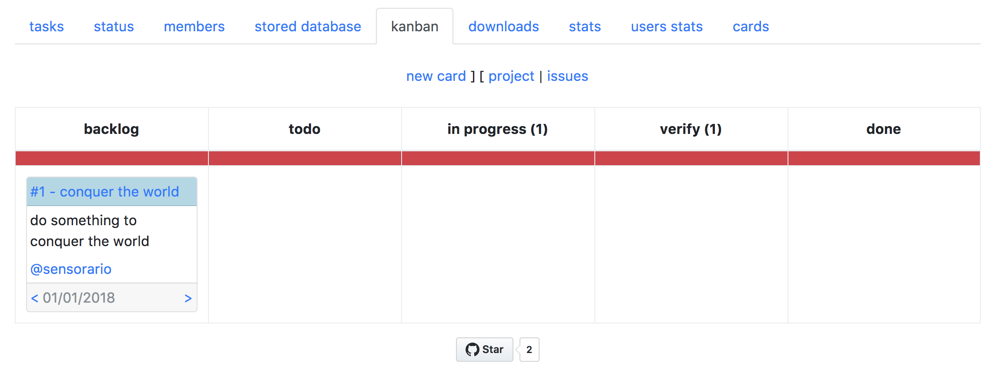

# kanbanoise

 - git clone https://github.com/sensorario/kanbanoise
 - cd kanbanoise
 - composer install
 - ./bin/console doctrine:fixtures:load --no-interaction
 - ./bin/console server:start
 - open http://localhost:8000 in your browser
 

